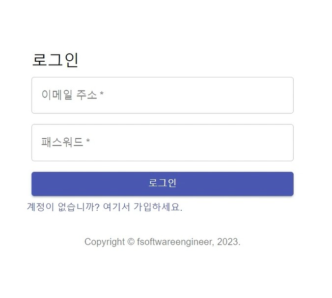
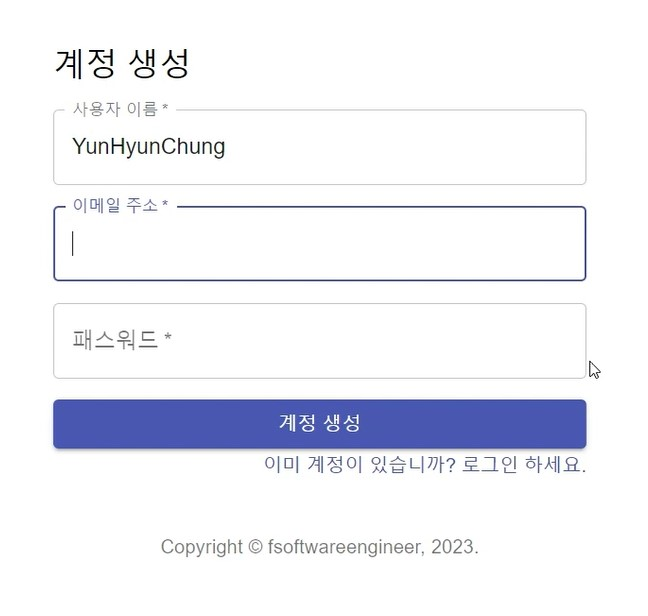
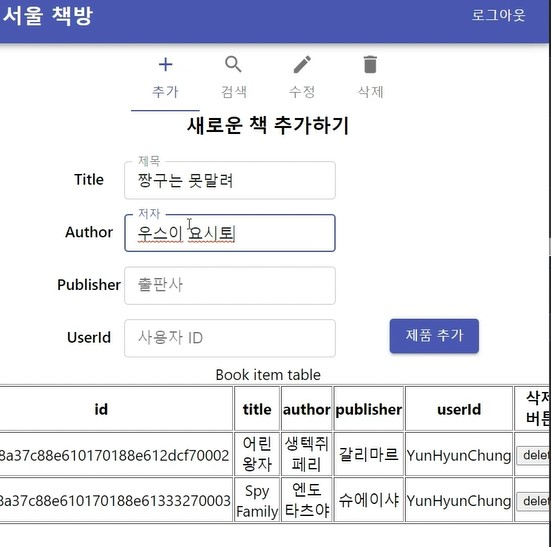
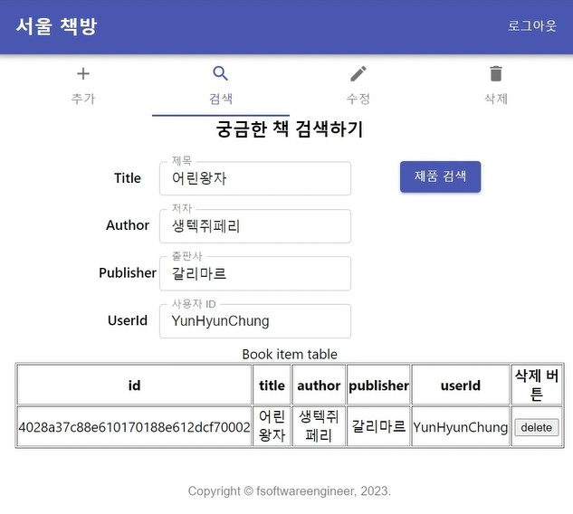
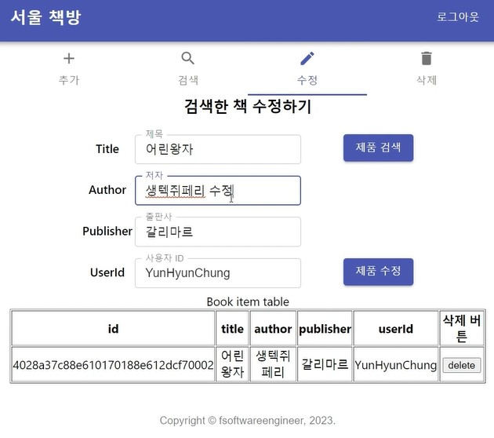
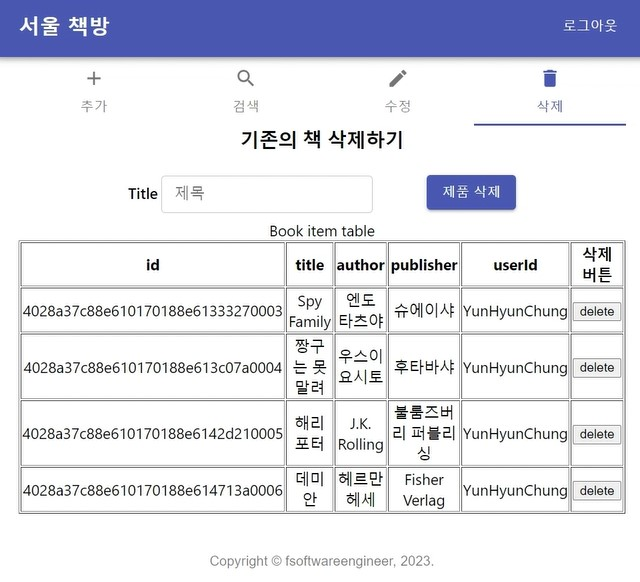

# SeoulBookstore
## "서울 책방" 웹 사이트 SPA(Single Page Application) 프로젝트

* __프로젝트 주제__: 

"서울 책방" 서점(쇼핑몰) 웹 응용 프로그램을 SPA(Single Page Application)로 개발

* __프로젝트 내용__: 

1) 도서 정보 CRUD (추가, 검색/조회, 수정, 삭제) 백엔드 기능
2) 프론트엔드 메뉴 GUI 개발
3) 현재 DB에 존재하는 제품 리스트를 모두 보여주는 테이블 표시 (UI/UX 및 CRUD 실시간 반영 기능 구현)
4) JWT 방식의 토큰 인증/필터를 이용한 회원가입, 로그인 기능 구현

* __수행 역할__: UI/UX 디자인, Full-stack (Front/Back-end 구현 및 서버 연결)
* __개발 기간__: 2023.05 ~ 2023.06
* __구조__: Layered Architecture (Controller, Service, Persistence) 
* __기술 스택__: Front-End(React, Node.js), Back-End(Springboot, Lombok, Gradle)
* __개발 환경__: Visual Studio Code(Front-end), IntelliJ IDEA(Back-end)
* __개발 언어__: Java(Back-end), Javascript(Front-end)
* __활용 Tool__: Postman (Request & Response Test)

-----
### __웹 서비스 이미지__

1. 로그인

2. 회원가입

3. 도서 추가

4. 도서 정보 검색

5. 도서 정보 수정

6. 도서 삭제

